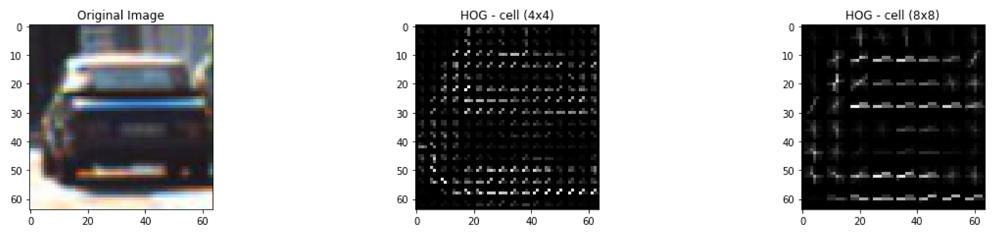
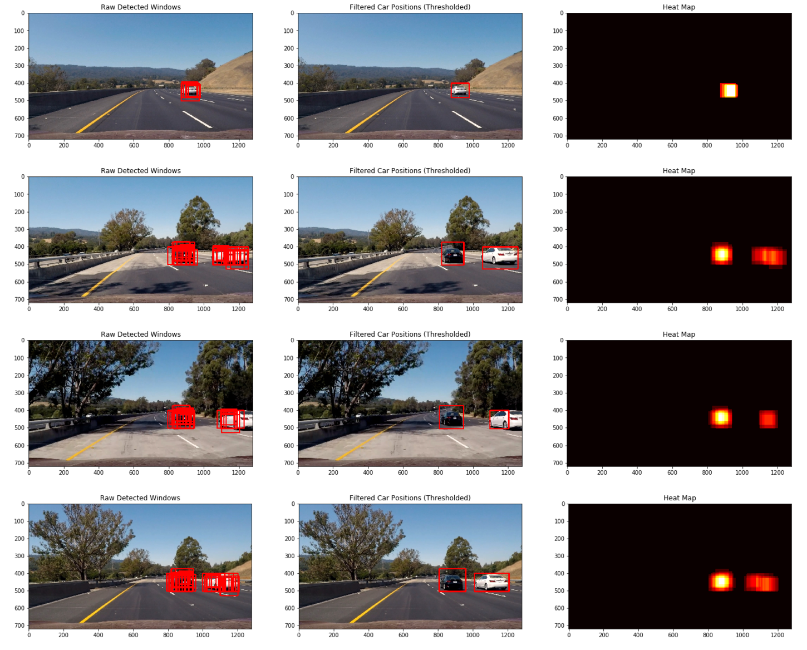

# Vehicle Detection

The goals / steps of this project are the following:

* Perform a Histogram of Oriented Gradients (HOG) feature extraction on a labeled training set of images and train a classifier Linear SVM classifier
* Apply a color transform and append binned color features, as well as histograms of color, to HOG feature vector. 
* Implement a sliding-window technique and use the trained classifier to search for vehicles in images.
* Run pipeline on a video stream and create a heat map of recurring detections frame by frame to reject outliers and follow detected vehicles.
* Estimate a bounding box for vehicles detected.

### Contents

`Writeup.ipynb` and `Writeup.html` contain more detail about the implementation.

`Writeup.ipynb` contains the pipeline functions / source

`utils.py` - most of the pipeline implementation utility functions

`BufferedHeatmap.py` - buffer wrapper for the heatmaps

`ouput_images` - some of the output from each stage of your pipeline

`project_video.mp4` - the video the pipeline was tested on

`test_images` -  example images for testing pipeline on single frames

`small_set` - small set of car & non-car images

---

## Data
Links to the labeled data for [vehicle](https://s3.amazonaws.com/udacity-sdc/Vehicle_Tracking/vehicles.zip) and [non-vehicle](https://s3.amazonaws.com/udacity-sdc/Vehicle_Tracking/non-vehicles.zip).

These example images come from a combination of the [GTI vehicle image database](http://www.gti.ssr.upm.es/data/Vehicle_database.html), the [KITTI vision benchmark suite](http://www.cvlibs.net/datasets/kitti/), and examples extracted from the project video itself.

---

### Features

* Color space: Manual inspection of several test images showed that the YUV color space seems to yield best results.

* HOG Features: It is desired to capture as much as possible the shape information of the object using gradient orientations. With too small of a cell-size HOGs features bring out the small shape information. While with large cell sizes "macro" shapes are captured. A cell size of (8x8) pixels tends to balance well the "macro" & "micro" shape charateristics of the vehicle.

* Image histograms along each color channel. Each image channel's histogram had 12 bins. I noticed that increasing the bins beyond this point doesn't give much improvement

* Spatial color features: this is simply a resized image - down from 64x64 to 16x16, then flattened, where the pixels of the image form the features. Images were reduced to save on performance.

* Features are standardized by removing the mean and scaling to unit variance

---

### Classification

A linear SVM classifier is used in this project. An optimized hyper-parameter search is desired, but it is very time consuming. 
A threshold of 1e-3 for the cost function was chosen to avoid over-fitting. This is a guess, and not a proper way to do this. It would be better to include this parameter in the hyper-parameter search (time consuming. Future improvement).

---

### Detection: Sliding Window

Assumptions: 

* Smaller vehicles are located farther from the vehicles and they appear more at the vanishinp point vertical position.

* Closer vehicles occupy larger pixel space. 

* Closer vehicles occupy the y-dimension starting from the vanishing point level to the bottom of the image

#### Sliding Scanning Window Algorithm
A number of window scales are chosen (5 for processing speed). The y-range between vanishing point - or middle of the height - and the bottom part of the image is divided into horizontal *search bands*. The search band defines the y-dimension search limits. 

For each scale, the search band is the summation of individual search bands along the vertical dimension. The window is smaller than the given search band.

Within each search band, the window slides by a given number of cells (as defined for the HOG features).

#### Heat-Map
To merge search results of the scanning window, the heat-map approach is used. For each positive result from the classifier, respective pixel hit-counts are incremented. Thus, for multiple positive windows, some pixels will have a higher hit count than others. This is viewed as a "hot" value, resulting in heat map, when viewed from the image perspective. So, for every image, there is a corresponding heat map of same size. 

To reduce the FP rate, the heatmap is thresholded, whereby only pixels of a certain value (threshold) are deemed as belonging to a positive object. 

---

## Test Image Results

The following is the result of the detection pipeline implemented.

---
